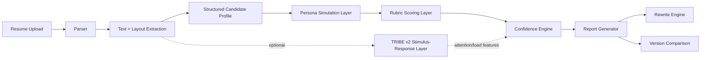
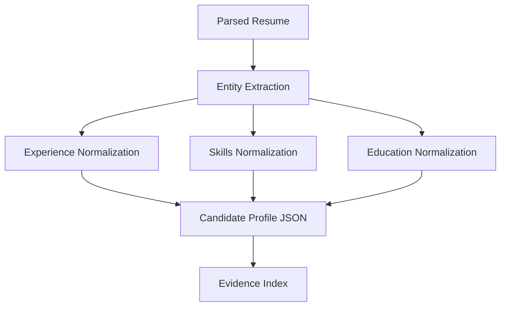
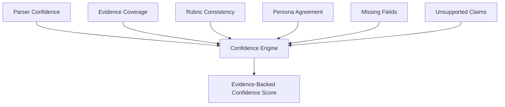
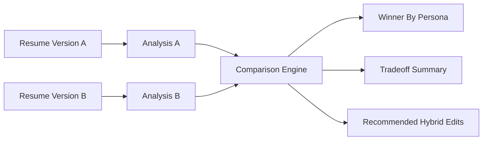

# System Architecture

## Overview

The system has two main responsibilities:

1. Convert a resume into reliable structured evidence.
2. Simulate evaluator reactions using personas, rubrics, and confidence scoring.

TRIBE v2-style analysis is optional and experimental. It can analyze the document as a stimulus, but should not be the source of hiring or admissions judgment.

## High-Level Pipeline



## Resume Upload And Parser

Responsibilities:

- Accept PDF, DOCX, Markdown, or plain text.
- Extract raw text.
- Preserve section order.
- Capture layout signals when possible: headings, bullet structure, whitespace, density, page count, tables, columns.
- Detect parsing failures and ambiguous regions.

Outputs:

```json
{
  "resume_id": "res_123",
  "raw_text": "...",
  "sections": [
    {
      "name": "Experience",
      "text": "...",
      "start_line": 18,
      "end_line": 52
    }
  ],
  "layout": {
    "page_count": 1,
    "columns_detected": false,
    "bullet_count": 14,
    "text_density": 0.72
  },
  "parser_confidence": 0.91
}
```

## Structured Extraction

The extraction layer creates a normalized candidate profile.

Fields:

- Name and contact information.
- Education.
- Work experience.
- Projects.
- Skills.
- Publications.
- Awards.
- Dates and gaps.
- Technologies.
- Metrics and quantified impact.
- Claims requiring support.



## Persona Simulation Layer

Each persona receives:

- Candidate profile.
- Evidence index.
- Optional target role or job description.
- Persona-specific rubric.
- Output schema.

Personas:

- Technical recruiter.
- Software engineering manager.
- AI/ML reviewer.
- Graduate admissions reviewer.
- Skeptical reviewer.
- ATS parser.
- Startup founder / technical cofounder.
- General non-technical HR reader.

## Rubric Scoring Layer

Rubrics should be explicit and persona-specific.

Common dimensions:

- Clarity.
- Credibility.
- Role fit.
- Evidence strength.
- Signal density.
- Technical depth.
- Impact.
- Seniority alignment.
- Risk flags.
- Missing information.

## Confidence Engine

Confidence is not the LLM's self-reported confidence. It is computed from measurable signals:

- Parser confidence.
- Evidence coverage.
- Rubric consistency.
- Persona agreement.
- Missing required fields.
- Ambiguity penalty.
- Unsupported claim penalty.



## Rewrite Engine

The rewrite engine converts diagnostics into targeted edits.

Inputs:

- Original bullet or section.
- Target role.
- Persona-specific criticism.
- Evidence available in the resume.
- User-provided additional facts.

Outputs:

- Suggested rewrite.
- What changed.
- Why it improves reader response.
- Risk warning if the rewrite adds unsupported claims.

## Version Comparison

Version comparison should answer:

- Which version creates the stronger first impression?
- Which version is better for the target role?
- Which version has better evidence density?
- Which version has higher credibility?
- Which version is easier for an ATS parser?



## Optional TRIBE v2 Stimulus-Response Layer

TRIBE v2 can be treated as an experimental analysis layer for stimulus response, not resume quality.

Potential inputs:

- Rendered resume pages as images/video frames.
- Text segments.
- Audio narration of a resume, if used in an experiment.

Potential outputs:

- Attention or salience estimates.
- Cognitive load proxies.
- Document density warnings.
- Version comparison as visual/text stimuli.

These features should be labeled experimental and should not override LLM agent judgment.

