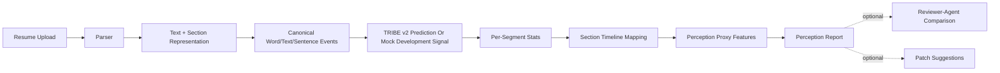
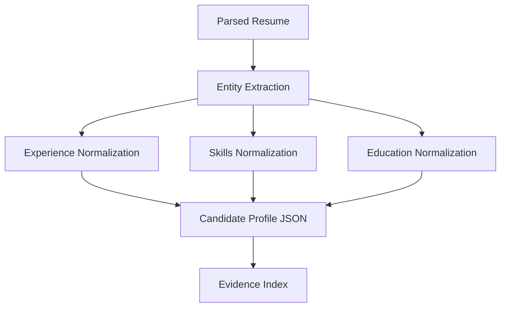
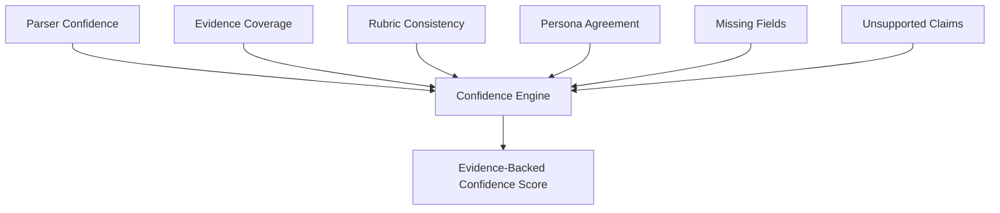
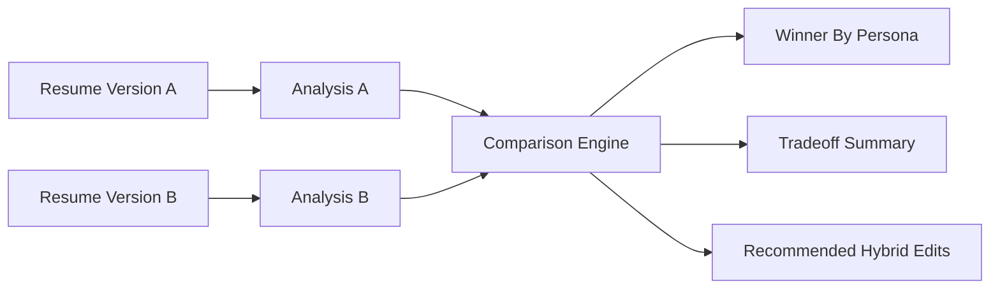

# System Architecture

## Overview

Current implementation has three main responsibilities:

1. Convert a resume/document into normalized text and canonical synthetic reading events.
2. Run TRIBE v2 or mock TRIBE-style prediction and extract section-level perception proxy signals.
3. Explain those signals with cautious, evidence-backed reports and optional reviewer-agent comparison.

TRIBE v2 is now the core experimental perception-simulation layer. It is still not a hiring or admissions judgment model. Ollama reviewer agents are optional comparison/explanation tools, not the core system by themselves.

## High-Level Pipeline



## Resume Upload And Parser

Responsibilities:

- Accept PDF, DOCX, Markdown, or plain text.
- Extract raw text.
- Preserve section order.
- Capture layout signals when possible: headings, bullet structure, whitespace, density, page count, tables, columns.
- Detect parsing failures and ambiguous regions.

Outputs:

```json
{
  "resume_id": "res_123",
  "raw_text": "...",
  "sections": [
    {
      "name": "Experience",
      "text": "...",
      "start_line": 18,
      "end_line": 52
    }
  ],
  "layout": {
    "page_count": 1,
    "columns_detected": false,
    "bullet_count": 14,
    "text_density": 0.72
  },
  "parser_confidence": 0.91
}
```

## Section And Evidence Extraction

The extraction layer creates bounded sections and evidence phrases for reporting. It should preserve section boundaries so education/coursework evidence does not leak into experience or project evidence.

Fields:

- Name and contact information.
- Education.
- Work experience.
- Projects.
- Skills.
- Publications.
- Awards.
- Dates and gaps.
- Technologies.
- Metrics and quantified impact.
- Claims requiring support.



## TRIBE Timeline And Feature Layer

Real TRIBE prediction output is stored as compact summaries:

- Prediction shape.
- Global response statistics.
- Exact per-segment statistics when available.
- Retained segment metadata.
- Canonical event CSV.
- Diagnostics and environment metadata.

Timeline analysis maps retained TRIBE time segments to document sections and computes:

- Raw salience proxy.
- Position-normalized salience.
- Cognitive-load proxy.
- Underemphasis proxy.
- Section duration, segment count, and stability hints.

These values are report signals, not quality scores.

## Optional Persona Simulation Layer

Each persona receives:

- Candidate profile.
- Evidence index.
- Optional target role or job description.
- Persona-specific rubric.
- Output schema.

Personas:

- Technical recruiter.
- Software engineering manager.
- AI/ML reviewer.
- Graduate admissions reviewer.
- Skeptical reviewer.
- ATS parser.
- Startup founder / technical cofounder.
- General non-technical HR reader.

## Rubric Scoring Layer

Rubrics should be explicit and persona-specific.

Common dimensions:

- Clarity.
- Credibility.
- Role fit.
- Evidence strength.
- Signal density.
- Technical depth.
- Impact.
- Seniority alignment.
- Risk flags.
- Missing information.

## Confidence Engine

Confidence is not the LLM's self-reported confidence. It is computed from measurable signals:

- Parser confidence.
- Evidence coverage.
- Rubric consistency.
- Persona agreement.
- Missing required fields.
- Ambiguity penalty.
- Unsupported claim penalty.



## Optional Rewrite And Patch Engine

Rewrite and patch tools convert diagnostics into suggested edits only when explicitly run. They are not the primary workflow.

Inputs:

- Original bullet or section.
- Target role.
- Persona-specific criticism.
- Evidence available in the resume.
- User-provided additional facts.

Outputs:

- Suggested rewrite.
- What changed.
- Why it improves reader response.
- Risk warning if the rewrite adds unsupported claims.

## Version Comparison

Version comparison should answer:

- Which version creates the stronger first impression?
- Which version is better for the target role?
- Which version has better evidence density?
- Which version has higher credibility?
- Which version is easier for an ATS parser?



## Cautions

- No human is scanned.
- Synthetic reading events are not natural reading behavior.
- TRIBE output is not resume quality or hiring prediction.
- Mock output is development/demo-only.
- Reviewer-agent output is simulated semantic feedback.
- Editing tools must preserve factual evidence.
